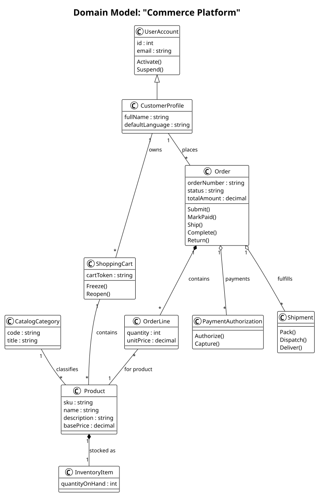

# MODT


**MODT** is a modeling language and CLI that turns concise, text-based system models into useful engineering artifacts: UML diagrams, SQL schema, and project documentation.

It is designed for teams that want modeling to stay versionable, reviewable, and close to the codebase instead of locked away in drag-and-drop tools.

## Why MODT

- **Text-first modeling** with a small, readable syntax that works well in Git
- **Multiple outputs from one source**: domain/design UML, activity, sequence, SSD, state, SQL, and docs
- **Scales from one file to many** with support for multi-file projects
- **Analysis and design phases** so conceptual and implementation views can coexist
- **Fast to adopt** with a `hello-world` scaffold and checked-in example projects

## What you get

From a single MODT project, you can generate:

- Requirements documentation with use cases, supplementary specifications, glossary/data dictionary entries, and operation contracts
- Domain and design class diagrams
- Activity, sequence, system-sequence, and state diagrams
- SQL DDL with metadata-driven type mapping
- Markdown documentation suitable for project handoff or review

## Installation

For most users, the best way to get started is to install a **prebuilt release** rather than building from source.

Release artifacts are already produced in [dist/releases](dist/releases) and can also be fetched through GitHub Releases.

### Recommended: install a release package

**Linux (.deb)**

```bash
sudo apt install ./modt_1.2.5_amd64.deb
```

**Linux (.rpm)**

```bash
sudo rpm -i ./modt_1.2.5_x86_64.rpm
```

**Linux (portable AppImage)**

```bash
chmod +x ./modt-1.2.5-x86_64.AppImage
./modt-1.2.5-x86_64.AppImage --help
```

**Windows**

- Use [dist/releases/modt-1.2.5-setup.exe](dist/releases/modt-1.2.5-setup.exe) for the installer experience
- Or use [dist/releases/modt-1.2.5-windows.zip](dist/releases/modt-1.2.5-windows.zip) for a portable bundle

### Build from source

If you want to hack on MODT itself or prefer a local build:

```bash
g++ -std=c++23 src/main.cpp src/Inspector/Inspector.cpp src/Generator/DocGenerator.cpp src/Generator/PumlGenerator.cpp src/Generator/SqlGenerator.cpp src/Parser/Parser.cpp -lncurses -o modt
```

The interactive inspector uses ncurses, so local builds need ncurses development headers installed.

## Quick start

### 1) Scaffold a starter project

```bash
./modt hello-world
```

### 2) Run MODT

```bash
./modt
./modt path/to/model.modt
./modt --input examples/commerce-platform
./modt inspect examples/commerce-platform
```

If you run `modt` inside a folder that already contains `.modt` files, MODT will automatically use the current directory as input.

## A tiny model

```modt
system
	name HelloMODT
	title My First Project

artifacts
	docs generated/docs/
	design generated/design/ [svg]
	sql generated/sql/hello.sql

obj User
	name: string
	login()

obj Database
	rel "uses" -- User
```

That single model can produce documentation, SQL, and diagrams.

## See the generated output

The repository includes checked-in example projects and their generated artifacts so you can evaluate MODT without running anything first.

### Commerce platform example
- [Model entrypoint](examples/commerce-platform/00_system.modt)
- [Visual walkthrough](examples/commerce-platform/README.md)
- [Generated documentation](examples/commerce-platform/generated/docs/commerce_platform.md)
- [SQL schema](examples/commerce-platform/generated/sql/commerce_platform.sql)



For the full visual tour, including activity, SSD, sequence, design, and state outputs, see [examples/commerce-platform/README.md](examples/commerce-platform/README.md).

### More example projects

| Project             | Focus                                                 | Guide                                                      | Docs                                                                       | Key previews                                                                                                         |
| ------------------- | ----------------------------------------------------- | ---------------------------------------------------------- | -------------------------------------------------------------------------- | -------------------------------------------------------------------------------------------------------------------- |
| Commerce Platform   | catalog, ordering, payments, fulfillment, returns     | [walkthrough](examples/commerce-platform/README.md)        | [docs](examples/commerce-platform/generated/docs/commerce_platform.md)     | [domain](examples/commerce-platform/generated/domain/CommercePlatform.domain.svg), [sequence](examples/commerce-platform/generated/sequence/CommercePlatform_Checkout.sequence.svg) |
| Fleet Operations    | dispatch, maintenance, work orders, trip states       | [guide](examples/fleet-operations/README.md)               | [docs](examples/fleet-operations/generated/docs/fleet_operations.md)       | [domain](examples/fleet-operations/generated/domain/FleetOperations.domain.svg), [sequence](examples/fleet-operations/generated/sequence/FleetOperations_DispatchTrip.sequence.svg) |
| Hospital Operations | scheduling, care delivery, actors, stateful workflows | [guide](examples/hospital-operations/README.md)            | [docs](examples/hospital-operations/generated/docs/hospital_operations.md) | [domain](examples/hospital-operations/generated/domain/HospitalOperations.domain.svg), [sequence](examples/hospital-operations/generated/sequence/HospitalOperations_ScheduleConsultation.sequence.svg) |

See [examples/README.md](examples/README.md) for a guided overview of the sample projects.

## Core concepts

- `system` defines project identity and description
- `artifacts` declares what to generate and where to write it
- `supplementary`, `glossary`, `op`, and `contract` capture requirements constraints, vocabulary, system operations, and operation contracts
- `obj` defines model elements, members, inheritance, and stereotypes
- `rel` defines relationships and multiplicities
- `uc` defines behavior for activity, sequence, SSD, and state outputs

MODT supports both **analysis** and **design** phases, allowing one model to produce both conceptual and implementation-oriented views.

## Common workflows

### Generate everything declared by an example

```bash
./modt --input examples/commerce-platform
```

### Generate from the current directory

```bash
cd some-project-with-modt-files
../modt
```

### Explore the CLI

```bash
./modt --help
./modt --interactive
./modt inspect path/to/model-or-folder
```

## Project layout

- [src](src) — parser, generators, and CLI entrypoint
- [examples](examples) — complete sample projects with checked-in outputs
- [Testing](Testing) — regression test runner and file-based test cases
- [Documentation.md](Documentation.md) — full language and CLI manual

## Development

Build from source:

```bash
g++ -std=c++23 src/main.cpp src/Inspector/Inspector.cpp src/Generator/DocGenerator.cpp src/Generator/PumlGenerator.cpp src/Generator/SqlGenerator.cpp src/Parser/Parser.cpp -lncurses -o modt
```

Run tests:

```bash
python3 Testing/test_runner.py
```

## Documentation

- [Documentation.md](Documentation.md) — full manual
- HTML and PDF version in every release

## License

MODT is licensed under the [GNU GPL v3](LICENSE).
