

Clinic Scheduling System

Operational workflow and software design

Preview document generated from the complex MODT testing model.

<table class="modt-title-metadata">
<tr><th>System</th><td>ClinicFlow</td></tr>
<tr><th>Audience</th><td>Product and engineering</td></tr>
<tr><th>Status</th><td>Preview</td></tr>
</table>

<nav id="TOC" class="modt-contents">
<h2>Contents</h2>
<ul>
<li class="toc-level-1"><a href="#report-overview">Report overview</a></li>
<li class="toc-level-1"><a href="#domain">Domain</a></li>
<li class="toc-level-2"><a href="#domain-diagram-group-1-structural-views">Structural Views</a></li>
<li class="toc-level-2"><a href="#glossary">Glossary</a></li>
<li class="toc-level-1"><a href="#analysis">Analysis</a></li>
<li class="toc-level-2"><a href="#analysis-diagram-group-1-activity-flows">Activity Flows</a></li>
<li class="toc-level-2"><a href="#analysis-diagram-group-2-system-interactions">System Interactions</a></li>
<li class="toc-level-2"><a href="#supplementary-specification">Supplementary Specification</a></li>
<li class="toc-level-2"><a href="#use-cases">Use Cases</a></li>
<li class="toc-level-3"><a href="#use-case-1-requestappointment">RequestAppointment</a></li>
<li class="toc-level-3"><a href="#use-case-2-confirmappointment">ConfirmAppointment</a></li>
<li class="toc-level-3"><a href="#use-case-3-completeconsultation">CompleteConsultation</a></li>
<li class="toc-level-2"><a href="#system-operations">System Operations</a></li>
<li class="toc-level-3"><a href="#system-operation-1-requestappointment-slotid-string">requestAppointment(slotId: string)</a></li>
<li class="toc-level-3"><a href="#system-operation-2-confirmappointment-appointmentid-string">confirmAppointment(appointmentId: string)</a></li>
<li class="toc-level-3"><a href="#system-operation-3-completeconsultation-consultationid-string">completeConsultation(consultationId: string)</a></li>
<li class="toc-level-2"><a href="#operation-contracts">Operation Contracts</a></li>
<li class="toc-level-3"><a href="#operation-contract-1-requestappointment-slotid">requestAppointment(slotId)</a></li>
<li class="toc-level-3"><a href="#operation-contract-2-confirmappointment-appointmentid">confirmAppointment(appointmentId)</a></li>
<li class="toc-level-3"><a href="#operation-contract-3-completeconsultation-consultationid">completeConsultation(consultationId)</a></li>
<li class="toc-level-1"><a href="#design">Design</a></li>
<li class="toc-level-2"><a href="#design-diagram-group-1-structural-views">Structural Views</a></li>
<li class="toc-level-2"><a href="#design-diagram-group-2-collaborator-interactions">Collaborator Interactions</a></li>
<li class="toc-level-2"><a href="#design-diagram-group-3-lifecycle-views">Lifecycle Views</a></li>
<li class="toc-level-2"><a href="#classes">Classes</a></li>
<li class="toc-level-3"><a href="#class-1-patient">Class: Patient</a></li>
<li class="toc-level-3"><a href="#class-2-clinician">Class: Clinician</a></li>
<li class="toc-level-3"><a href="#class-3-room">Class: Room</a></li>
<li class="toc-level-3"><a href="#class-4-appointment">Class: Appointment</a></li>
<li class="toc-level-3"><a href="#class-5-consultation">Class: Consultation</a></li>
<li class="toc-level-3"><a href="#class-6-schedulingcontroller">Class: SchedulingController</a></li>
<li class="toc-level-3"><a href="#class-7-consultationcontroller">Class: ConsultationController</a></li>
<li class="toc-level-3"><a href="#class-8-schedulingservice">Class: SchedulingService</a></li>
<li class="toc-level-3"><a href="#class-9-roomcalendar">Class: RoomCalendar</a></li>
<li class="toc-level-3"><a href="#class-10-clinicalrecord">Class: ClinicalRecord</a></li>
<li class="toc-level-3"><a href="#class-11-receptiondesk">Class: ReceptionDesk</a></li>
<li class="toc-level-2"><a href="#enumerations">Enumerations</a></li>
<li class="toc-level-3"><a href="#enum-1-appointmentstatus">Enum: AppointmentStatus</a></li>
<li class="toc-level-3"><a href="#enum-2-triagelevel">Enum: TriageLevel</a></li>
<li class="toc-level-2"><a href="#relationships">Relationships</a></li>
<li class="toc-level-1"><a href="#implementation">Implementation</a></li>
<li class="toc-level-2"><a href="#class-operations">Class Operations</a></li>
</ul>
</nav>

# Clinic Scheduling System {#report-overview}

_Requirements and design report_

Patients book appointments, staff confirm availability, and clinicians complete consultations.

| Item | Count |
| --- | ---: |
| Requirements | 3 |
| Glossary terms | 3 |
| Use cases | 3 |
| System operations | 3 |
| Operation contracts | 3 |
| Classes | 11 |
| Relationships | 7 |

## Domain {#domain}

### Structural Views {#domain-diagram-group-1-structural-views}

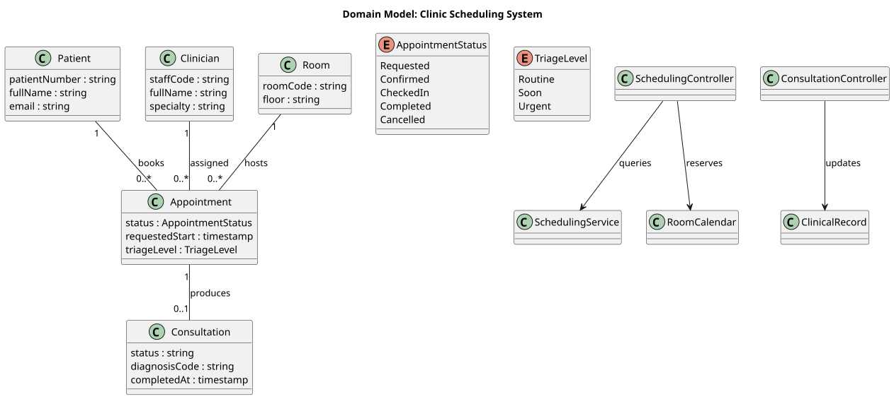

### Glossary {#glossary}

| Term | Definition | Rules |
| --- | --- | --- |
| Appointment | Reserved time slot between a patient and clinician. | Status is Requested, Confirmed, CheckedIn, Completed, or Cancelled. |
| Consultation | Clinical encounter attached to a confirmed appointment. | A consultation cannot be completed before check-in. |
| Triage Level | Priority assigned by intake staff. | Allowed values are Routine, Soon, Urgent. |

## Analysis {#analysis}

### Activity Flows {#analysis-diagram-group-1-activity-flows}

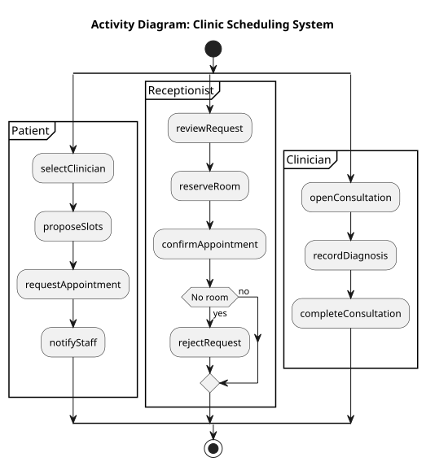

### System Interactions {#analysis-diagram-group-2-system-interactions}

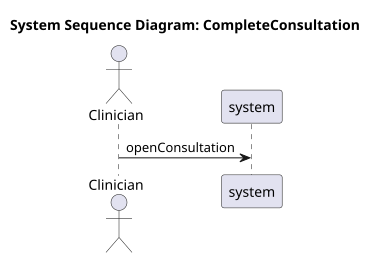

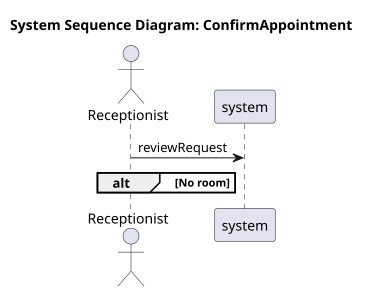

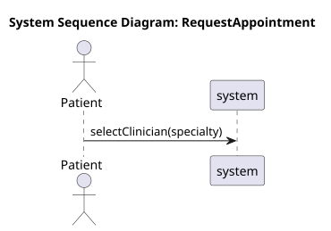

### Supplementary Specification {#supplementary-specification}

| Category | Requirement | Description |
| --- | --- | --- |
| usability | Fast booking | A returning patient can request an appointment without re-entering profile data. |
| reliability | Audit trail | Appointment status changes are recorded. |
| privacy | Patient data | Clinical notes are visible only to authorized staff. |

### Use Cases {#use-cases}

| Use Case | Primary Actor | Steps | Preconditions | Postconditions |
| --- | --- | ---: | ---: | ---: |
| RequestAppointment | Patient | 4 | 1 | 1 |
| ConfirmAppointment | Receptionist | 4 | 1 | 1 |
| CompleteConsultation | Clinician | 3 | 1 | 1 |

#### RequestAppointment {#use-case-1-requestappointment}

**Description:** Patient requests a clinician and time window.

**Actor:** Patient

**Preconditions:**
- Patient profile exists

**Flow of Events:**
1. selectClinician 
    - specialty: string
2. proposeSlots (Target: SchedulingService)
    - clinicianId: string
3. requestAppointment 
    - slotId: string
4. notifyStaff (Target: ReceptionDesk)

**Postconditions:**
- `Appointment.status == Requested`

#### ConfirmAppointment {#use-case-2-confirmappointment}

**Description:** Receptionist confirms or rejects a requested appointment.

**Actor:** Receptionist

**Preconditions:**
- `Appointment.status == Requested`

**Flow of Events:**
1. reviewRequest 
2. reserveRoom (Target: RoomCalendar)
    - appointmentId: string
3. confirmAppointment 
4. Alt: No room rejectRequest 

**Postconditions:**
- `Appointment.status == Confirmed`

#### CompleteConsultation {#use-case-3-completeconsultation}

**Description:** Clinician records notes and completes the consultation.

**Actor:** Clinician

**Preconditions:**
- `Appointment.status == CheckedIn`

**Flow of Events:**
1. openConsultation 
2. recordDiagnosis (Target: ClinicalRecord)
    - diagnosisCode: string
3. completeConsultation 

**Postconditions:**
- `Consultation.status == Completed`

### System Operations {#system-operations}

| Operation | Actor | Use Case |
| --- | --- | --- |
| requestAppointment(slotId: string) | Patient | RequestAppointment |
| confirmAppointment(appointmentId: string) | Receptionist | ConfirmAppointment |
| completeConsultation(consultationId: string) | Clinician | CompleteConsultation |

#### requestAppointment(slotId: string) {#system-operation-1-requestappointment-slotid-string}

**Actor:** Patient

**Use Case:** RequestAppointment

**Preconditions:**
- Patient profile exists

**Postconditions:**
- `Appointment.status == Requested`

#### confirmAppointment(appointmentId: string) {#system-operation-2-confirmappointment-appointmentid-string}

**Actor:** Receptionist

**Use Case:** ConfirmAppointment

**Preconditions:**
- `Appointment.status == Requested`

**Postconditions:**
- `Appointment.status == Confirmed`

#### completeConsultation(consultationId: string) {#system-operation-3-completeconsultation-consultationid-string}

**Actor:** Clinician

**Use Case:** CompleteConsultation

**Preconditions:**
- `Appointment.status == CheckedIn`

**Postconditions:**
- `Consultation.status == Completed`

### Operation Contracts {#operation-contracts}

#### requestAppointment(slotId) {#operation-contract-1-requestappointment-slotid}

**Use Case:** RequestAppointment

**Preconditions:**
- Patient profile exists

**Postconditions:**
- Appointment instance is created
- `Appointment.status == Requested`
- Patient rel "--" Appointment is formed

#### confirmAppointment(appointmentId) {#operation-contract-2-confirmappointment-appointmentid}

**Use Case:** ConfirmAppointment

**Preconditions:**
- `Appointment.status == Requested`

**Postconditions:**
- `Appointment.status == Confirmed`
- Room rel "--" Appointment is formed

#### completeConsultation(consultationId) {#operation-contract-3-completeconsultation-consultationid}

**Use Case:** CompleteConsultation

**Preconditions:**
- `Appointment.status == CheckedIn`

**Postconditions:**
- `Consultation.status == Completed`
- ClinicalRecord is updated

## Design {#design}

### Structural Views {#design-diagram-group-1-structural-views}

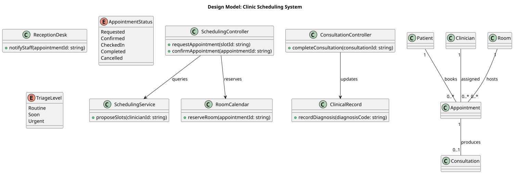

### Collaborator Interactions {#design-diagram-group-2-collaborator-interactions}

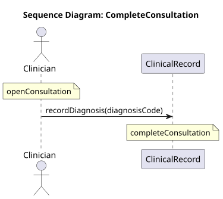

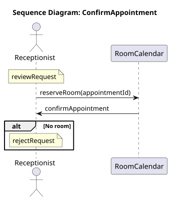

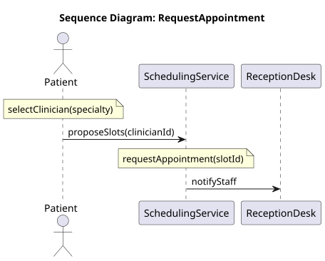

### Lifecycle Views {#design-diagram-group-3-lifecycle-views}

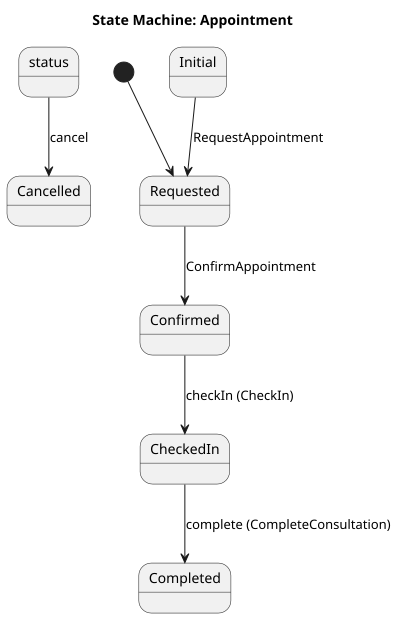

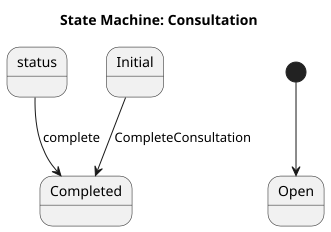

### Classes {#classes}

| Class | Attributes | Methods | Responsibility Signal |
| --- | ---: | ---: | --- |
| Patient | 3 | 0 | 3 attributes |
| Clinician | 3 | 0 | 3 attributes |
| Room | 2 | 0 | 2 attributes |
| Appointment | 3 | 3 | 3 operations |
| Consultation | 3 | 1 | 1 operations |
| SchedulingController | 0 | 2 | 2 operations |
| ConsultationController | 0 | 1 | 1 operations |
| SchedulingService | 0 | 1 | 1 operations |
| RoomCalendar | 0 | 1 | 1 operations |
| ClinicalRecord | 0 | 1 | 1 operations |
| ReceptionDesk | 0 | 1 | 1 operations |

#### Class: Patient {#class-1-patient}

##### Attributes

| Attribute | Type | Visibility | Metadata |
| --- | --- | --- | --- |
| patientNumber | string | unspecified | - |
| fullName | string | unspecified | - |
| email | string | unspecified | - |

#### Class: Clinician {#class-2-clinician}

##### Attributes

| Attribute | Type | Visibility | Metadata |
| --- | --- | --- | --- |
| staffCode | string | unspecified | - |
| fullName | string | unspecified | - |
| specialty | string | unspecified | - |

#### Class: Room {#class-3-room}

##### Attributes

| Attribute | Type | Visibility | Metadata |
| --- | --- | --- | --- |
| roomCode | string | unspecified | - |
| floor | string | unspecified | - |

#### Class: Appointment {#class-4-appointment}

##### Attributes

| Attribute | Type | Visibility | Metadata |
| --- | --- | --- | --- |
| status | AppointmentStatus | unspecified | `initial(Requested)`, `state` |
| requestedStart | timestamp | unspecified | - |
| triageLevel | TriageLevel | unspecified | - |

#### Class: Consultation {#class-5-consultation}

##### Attributes

| Attribute | Type | Visibility | Metadata |
| --- | --- | --- | --- |
| status | string | unspecified | `initial(Open)`, `state` |
| diagnosisCode | string | unspecified | - |
| completedAt | timestamp | unspecified | - |

#### Class: SchedulingController {#class-6-schedulingcontroller}

#### Class: ConsultationController {#class-7-consultationcontroller}

#### Class: SchedulingService {#class-8-schedulingservice}

#### Class: RoomCalendar {#class-9-roomcalendar}

#### Class: ClinicalRecord {#class-10-clinicalrecord}

#### Class: ReceptionDesk {#class-11-receptiondesk}

### Enumerations {#enumerations}

#### Enum: AppointmentStatus {#enum-1-appointmentstatus}

**Values:**
- `Requested`
- `Confirmed`
- `CheckedIn`
- `Completed`
- `Cancelled`

#### Enum: TriageLevel {#enum-2-triagelevel}

**Values:**
- `Routine`
- `Soon`
- `Urgent`

### Relationships {#relationships}

| From | Type | To | Label |
| --- | --- | --- | --- |
| Patient "1" | -- | Appointment "0..*" | books |
| Clinician "1" | -- | Appointment "0..*" | assigned |
| Room "1" | -- | Appointment "0..*" | hosts |
| Appointment "1" | -- | Consultation "0..1" | produces |
| SchedulingController | --> | SchedulingService | queries |
| SchedulingController | --> | RoomCalendar | reserves |
| ConsultationController | --> | ClinicalRecord | updates |

## Implementation {#implementation}

### Class Operations {#class-operations}

#### Class: Appointment Operations {#class-operations-appointment}

| Method | Visibility | Effects | Metadata | Pre/Post Conditions |
| --- | --- | --- | --- | --- |
| checkIn() | unspecified | `CheckIn`: (Confirmed) status -> CheckedIn | - | - |
| cancel() | unspecified | `Always`: status -> Cancelled | - | - |
| complete() | unspecified | `CompleteConsultation`: (CheckedIn) status -> Completed | - | - |

#### Class: Consultation Operations {#class-operations-consultation}

| Method | Visibility | Effects | Metadata | Pre/Post Conditions |
| --- | --- | --- | --- | --- |
| complete() | unspecified | `Always`: status -> Completed | - | - |

#### Class: SchedulingController Operations {#class-operations-schedulingcontroller}

| Method | Visibility | Effects | Metadata | Pre/Post Conditions |
| --- | --- | --- | --- | --- |
| requestAppointment(slotId: string) | + | - | - | - |
| confirmAppointment(appointmentId: string) | + | - | - | - |

#### Class: ConsultationController Operations {#class-operations-consultationcontroller}

| Method | Visibility | Effects | Metadata | Pre/Post Conditions |
| --- | --- | --- | --- | --- |
| completeConsultation(consultationId: string) | + | - | - | - |

#### Class: SchedulingService Operations {#class-operations-schedulingservice}

| Method | Visibility | Effects | Metadata | Pre/Post Conditions |
| --- | --- | --- | --- | --- |
| proposeSlots(clinicianId: string) | + | - | - | - |

#### Class: RoomCalendar Operations {#class-operations-roomcalendar}

| Method | Visibility | Effects | Metadata | Pre/Post Conditions |
| --- | --- | --- | --- | --- |
| reserveRoom(appointmentId: string) | + | - | - | - |

#### Class: ClinicalRecord Operations {#class-operations-clinicalrecord}

| Method | Visibility | Effects | Metadata | Pre/Post Conditions |
| --- | --- | --- | --- | --- |
| recordDiagnosis(diagnosisCode: string) | + | - | - | - |

#### Class: ReceptionDesk Operations {#class-operations-receptiondesk}

| Method | Visibility | Effects | Metadata | Pre/Post Conditions |
| --- | --- | --- | --- | --- |
| notifyStaff(appointmentId: string) | + | - | - | - |

