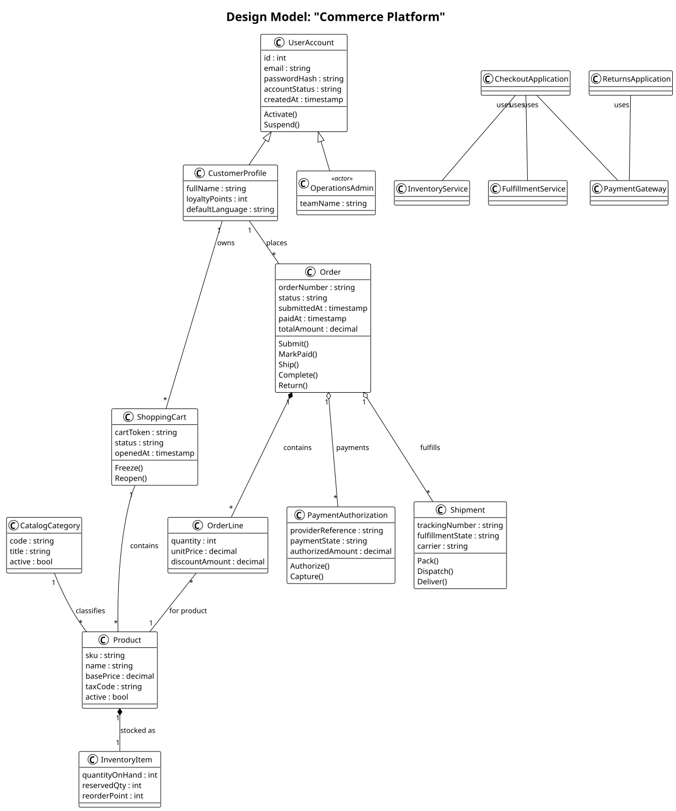
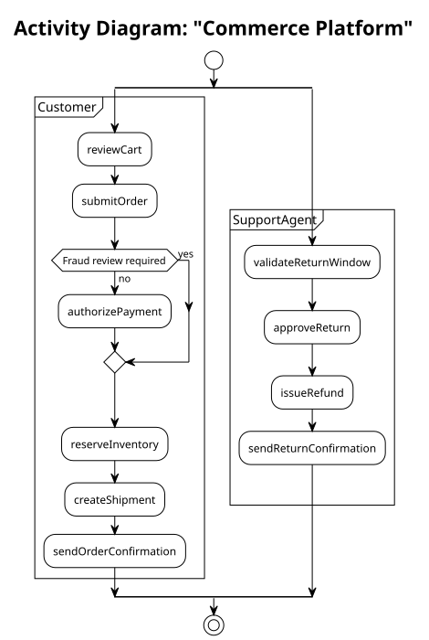
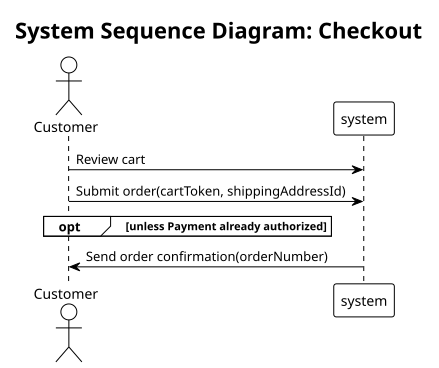
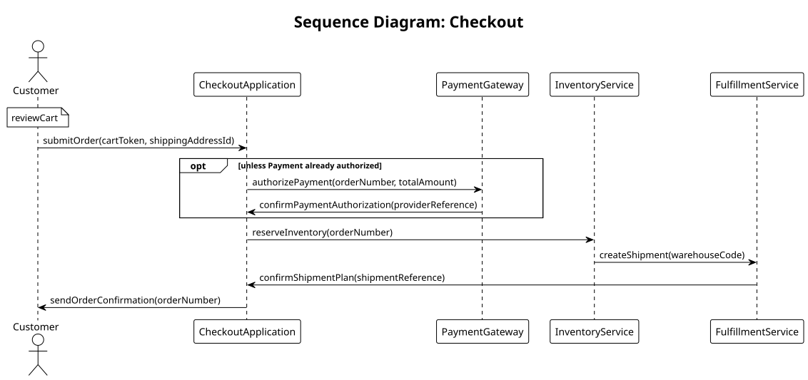
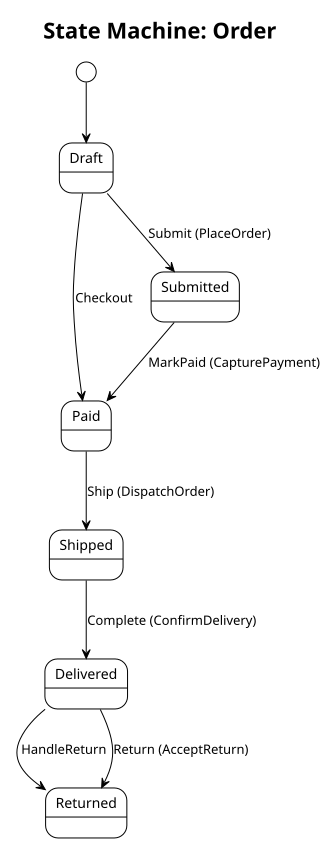

# Commerce Platform

A multi-file marketplace example that models:

- customer identity and account lifecycle
- product catalog and inventory
- carts, orders, payments, shipments, and returns
- use cases for checkout and returns
- SQL metadata for schema-oriented generation

Run from the repository root:

```bash
./modt --input examples/commerce-platform
```

Generated files land in `examples/commerce-platform/generated/` and are checked into the repository as an example snapshot.

## What this example generates

- [Generated documentation](generated/docs/commerce_platform.md)
- [SQL schema](generated/sql/commerce_platform.sql)
- [Domain diagram](generated/domain/CommercePlatform.domain.svg)
- [Design diagram](generated/design/CommercePlatform.design.svg)
- [Checkout activity](generated/activity/CommercePlatform.activity.svg)
- [Checkout SSD](generated/ssd/CommercePlatform_Checkout.ssd.svg)
- [Checkout sequence](generated/sequence/CommercePlatform_Checkout.sequence.svg)
- [HandleReturn sequence](generated/sequence/CommercePlatform_HandleReturn.sequence.svg)
- [Order state](generated/state/CommercePlatform_Order.state.svg)

## Visual walkthrough

### Domain model


### Design model



### Activity diagram

The activity view is the richest control-flow projection. This is where branching, forward skips, retries, and converging paths are easiest to read.



### System sequence diagram

The SSD keeps only actor/system boundary traffic, which is useful for requirements and API-level discussion.



### Full sequence diagram

The full sequence keeps collaborator handoffs while projecting system-only behavior into a cleaner interaction trace.





### State machine

## Reading the behavior model

- `step [Submit order] :> CheckoutApplication` enters the flow through `CheckoutApplication`, so the full sequence shows an explicit application participant orchestrating downstream services instead of making the actor talk directly to infrastructure.
- `step [Confirm payment authorization]` and `step [Confirm shipment plan]` bring control back to the application participant, which keeps the checkout sequence from looking like disconnected one-way calls.
- `step [Review cart]` remains a local user action, so it stays annotated rather than becoming a fake system call.
- `alt [Payment already authorized] goto @inventoryReservation` models an optional authorization block in the activity view and an `opt unless ...` region in the full sequence.
- SSD and sequence are both derived from the same `uc`, but they intentionally emphasize different concerns.
